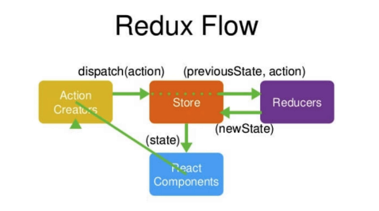

# react_learn
react学习笔记之redux
   

1.createStore(创建store)
```javascript
const store =createStore(
    reducer
);
```
2.Store.dispatch(把action传递给store)
```javascript
  handleBtnClick() {
        const action =getAddItemAction();
        store.dispatch(action);
    }
```
3.Store.getState(获取store中的所有数据内容)
```javascript
handleStoreChange() {
        this.setState(store.getState());
    }
```
4.Store.subscribe（监听store数据的改变）
```javascript
 store.subscribe(this.handleStoreChange);
```
